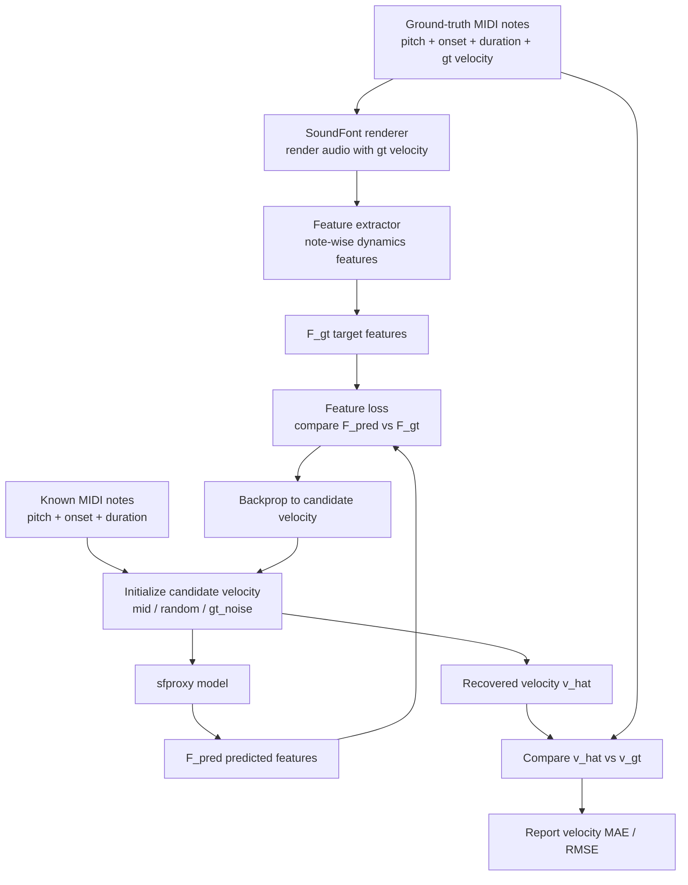

# Sfproxy Eval

## One-line Summary

This evaluation asks a very specific question:

**If we know the MIDI notes and only hide the note velocities, can the sfproxy
model provide gradients that let us recover the ground-truth velocities from
target note features?**

---

## Flowchart



---

## What Is `target` and What Is `pred`?

### `target`

`target` is **not** the velocity itself.

`target` is the note-wise dynamics feature extracted from the **real rendered
audio** generated with the **ground-truth velocity**.

More explicitly:

```text
audio_gt = RenderSF2(notes, v_gt)
F_gt     = FeatureExtractor(audio_gt, notes)
```

In this codebase, the feature extractor is not the proxy model. It is the
hand-defined dynamics feature extractor in
[src/sfproxy/features/dynamics.py](/media/mengh/SharedData/zhanh/synth-proxy_v1/src/sfproxy/features/dynamics.py),
which currently produces note-level features such as:

- harmonic energy
- onset flux

### `pred`

`pred` is the feature predicted by the sfproxy model under the **current guessed
velocity**:

```text
F_pred = Sfproxy(notes, v_candidate)
```

So the optimization loop is:

```text
adjust v_candidate
so that F_pred gets close to F_gt
```

---

## The Correct Mental Model

The right formulation is:

```text
audio_gt = RenderSF2(notes, v_gt)
F_gt     = FeatureExtractor(audio_gt, notes)
F_pred   = Sfproxy(notes, v_candidate)

optimize v_candidate to minimize Loss(F_pred, F_gt)
final evaluation: compare v_candidate (or v_hat) against v_gt
```

The common misunderstanding is:

```text
F_gt = Sfproxy(notes, v_gt)
```

That is **not** what this evaluation does.

`F_gt` comes from the rendered audio plus the feature extractor, not from the
proxy itself.

---

## Why Is the Final Metric Velocity MAE / RMSE Instead of Only Feature Error?

Your intuition was close, but the key distinction is:

- `feature loss` is the **optimization objective**
- `velocity error` is the **actual evaluation target**

Why do we still need velocity MAE / RMSE?

### 1. Because the real question is recovery of velocity

This benchmark is called velocity recovery because the thing we want back is the
ground-truth velocity, not just a low feature loss.

If `v_hat` is close to `v_gt`, the recovery worked.

If `F_pred` is close to `F_gt` but `v_hat` is still wrong, then the model does
not identify velocity reliably.

### 2. Because feature matching can be ambiguous

Different velocities can sometimes produce similar note features, especially in
hard cases like dense overlap or large chords.

That means:

```text
small feature error
does not always imply
small velocity error
```

### 3. Because feature-space quality is already reported separately

This evaluation does not ignore feature-space performance.

It also reports:

- `feat_mae_at_vhat`
- `opt_loss_final`

Those tell you whether the recovered velocity produces a feature prediction that
matches the target feature.

But the main question is still:

**Did we recover the true velocity?**

That is why `vel_mae` and `vel_rmse` are the primary metrics.

---

## What Do `in-domain` and `stress` Mean?

These are **not** two real datasets.

They are two synthetic evaluation settings using the same SoundFont and the same
overall task.

### `in-domain`

This means the note sampler matches the normal training/export distribution more
closely.

Intuition:

- normal polyphony
- normal overlap
- normal note density

This is the easier and more expected setting.

### `stress`

This is a deliberately harder setting.

Intuition:

- denser polyphony
- larger chords
- shorter IOI
- more overlap between notes

So:

- `in-domain` = regular exam
- `stress` = pressure test

Important:

`stress` is still the same Salamander piano setup, not a different instrument
domain. It is mainly a **harder note-configuration distribution**.

---

## What This Evaluation Actually Proves

If the result is good, it means:

- the proxy responds meaningfully to velocity changes
- the feature gradients with respect to velocity are useful
- gradient-based velocity recovery is feasible

If `stress` is much worse than `in-domain`, it usually means:

- the proxy is fine on normal note layouts
- but it becomes less reliable when notes overlap heavily

---

## How To Read the Report

Main metrics:

- `vel_mae`: average absolute error between recovered velocity and ground-truth velocity
- `vel_rmse`: same idea, but penalizes large mistakes more
- `init_vel_mae`: error before optimization starts
- `mae_improvement_vs_init_pct`: how much recovery improved over the initial guess
- `feat_mae_at_vhat`: feature-space mismatch after recovery

In the current implementation:

- `vel_mae` and `vel_rmse` are reported in MIDI velocity units `[0,127]`
- normalized `[0,1]` versions are also kept as `*_01`

---

## Example Interpretation For Your Current Run

For your latest run:

- `in-domain vel_mae ≈ 10.3`
- `stress vel_mae ≈ 17.5`
- `in-domain improvement ≈ 70.8%`
- `stress improvement ≈ 48.5%`

This means:

- the model clearly provides useful gradients
- recovery works well in the normal setting
- recovery still works under stress, but the model degrades noticeably when the
  note layout becomes denser and more overlapping

---

## Bottom Line

The cleanest way to think about this evaluation is:

1. Use real rendered audio with ground-truth velocity to define `F_gt`
2. Use sfproxy to predict `F_pred` from MIDI notes plus guessed velocity
3. Optimize the guessed velocity using feature loss
4. Judge success by whether the recovered velocity matches the true velocity

So the feature loss is the tool.

The velocity MAE / RMSE is the answer.
