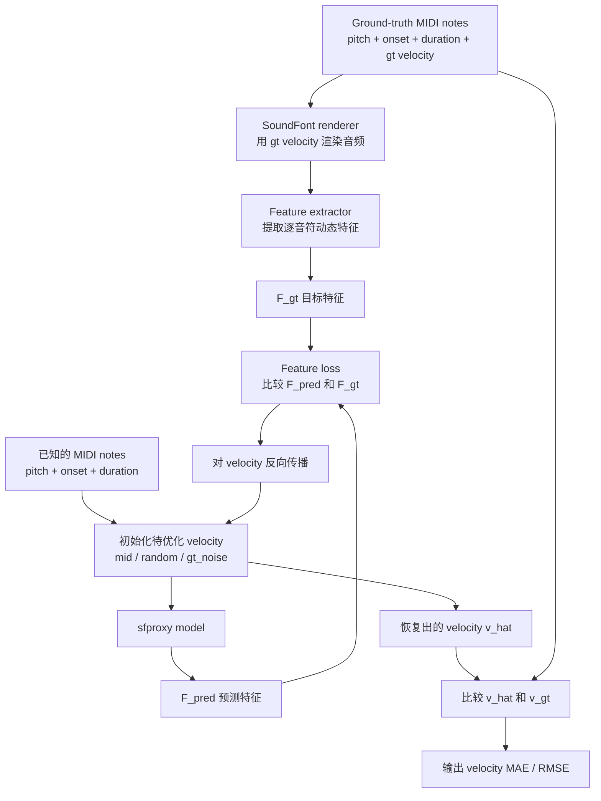

# Sfproxy Eval 中文说明

## 一句话总结

这个 evaluation 主要在回答一个很具体的问题：

**如果我们知道 MIDI notes，只把 note velocity 藏起来，sfproxy 能不能提供有用的梯度，让我们把 ground-truth velocity 从目标 note feature 里反推回来？**

---

## 流程图



---

## `target` 和 `pred` 到底是什么？

### `target`

`target` **不是 velocity 本身**。

`target` 是用 **ground-truth velocity** 渲染出的真实音频，再经过特征提取得到的逐音符动态特征。

更明确地写就是：

```text
audio_gt = RenderSF2(notes, v_gt)
F_gt     = FeatureExtractor(audio_gt, notes)
```

在这个仓库里，feature extractor 不是 proxy 模型本身，而是
[src/sfproxy/features/dynamics.py](/media/mengh/SharedData/zhanh/synth-proxy_v1/src/sfproxy/features/dynamics.py)
里的手工定义特征。目前主要包括：

- harmonic energy
- onset flux

### `pred`

`pred` 是 sfproxy 在“当前猜测的 velocity”下预测出来的特征：

```text
F_pred = Sfproxy(notes, v_candidate)
```

所以整个优化过程其实是：

```text
不断调整 v_candidate
让 F_pred 尽量接近 F_gt
```

---

## 正确的理解方式

最准确的表述是：

```text
audio_gt = RenderSF2(notes, v_gt)
F_gt     = FeatureExtractor(audio_gt, notes)
F_pred   = Sfproxy(notes, v_candidate)

优化 v_candidate，使 Loss(F_pred, F_gt) 最小
最后再比较 v_hat 和 v_gt
```

一个很常见的误解是：

```text
F_gt = Sfproxy(notes, v_gt)
```

这 **不是** 这个 evaluation 在做的事。

这里的 `F_gt` 不是 proxy 算出来的，而是：

- 先用 SF2 renderer 渲染音频
- 再从音频里提取 note-level dynamics feature

---

## 为什么最终指标是 Velocity MAE / RMSE，而不是只看 Feature Error？

你的直觉并不离谱，但关键区别在这里：

- `feature loss` 是 **优化目标**
- `velocity error` 是 **最终评估目标**

为什么还要看 velocity MAE / RMSE？

### 1. 因为这个 benchmark 真正关心的是 velocity recovery

这个测试的名字就是 velocity recovery。

我们最终想知道的是：

**恢复出来的 velocity 对不对。**

如果 `v_hat` 很接近 `v_gt`，说明 recovery 成功。

如果 `F_pred` 很接近 `F_gt`，但 `v_hat` 仍然离 `v_gt` 很远，那就说明这个模型虽然 feature 能对上，但 velocity 本身并没有被可靠地识别出来。

### 2. 因为 feature matching 可能有歧义

不同的 velocity，在一些复杂场景下可能会产生比较相似的 feature，特别是：

- 多音同时重叠很多的时候
- 和弦很大的时候
- IOI 很短的时候

所以：

```text
feature error 小
并不一定意味着
velocity error 小
```

### 3. 因为 feature-space 指标已经单独报告了

这个 evaluation 并没有忽略 feature-space 的表现。

它同时也会报告：

- `feat_mae_at_vhat`
- `opt_loss_final`

这些指标告诉你：

**恢复出来的 velocity 所对应的 feature prediction，和目标 feature 到底还有多大差距。**

但主问题仍然是：

**恢复出来的 velocity 和真实 velocity 有多接近？**

所以主指标依然应该是：

- `vel_mae`
- `vel_rmse`

---

## `in-domain` 和 `stress` 是什么意思？

它们 **不是两份真实数据集**。

它们是同一个 SoundFont、同一个任务下的两种合成评估设置。

### `in-domain`

`in-domain` 的意思是：

这组样本的采样分布尽量接近训练/导出时的默认设置。

直觉上就是：

- 正常的 polyphony
- 正常的 overlap
- 正常的 note density

所以它更像“常规情况”。

### `stress`

`stress` 的意思是：

故意把问题变难。

直觉上就是：

- 更密的 polyphony
- 更大的 chord
- 更短的 IOI
- 更多 note overlap

所以你可以把它理解成：

- `in-domain` = 正常考试题
- `stress` = 压力测试题

要特别注意：

`stress` 仍然还是同一个 Salamander piano、同一个 SoundFont 条件。

它不是“换了域”，不是换成另一种乐器或另一套录音环境，而是：

**在同一个域里，故意采样更难的 note 配置。**

---

## 这个 Evaluation 真正证明了什么？

如果结果好，说明：

- proxy 对 velocity 的变化是有响应的
- feature 对 velocity 的梯度是有用的
- 用梯度优化来恢复 velocity 这件事是可行的

如果 `stress` 明显比 `in-domain` 差，通常说明：

- 在正常 note 布局下，这个 proxy 已经够用了
- 但一旦音符重叠变多，它的可靠性就会下降

---

## 报告怎么读？

主要看这些指标：

- `vel_mae`: 恢复出的 velocity 和 ground-truth velocity 之间的平均绝对误差
- `vel_rmse`: 同样是 velocity 误差，但更惩罚大的错误
- `init_vel_mae`: 还没开始优化前的初始误差
- `mae_improvement_vs_init_pct`: 相对初始猜测，误差下降了多少
- `feat_mae_at_vhat`: 恢复后的 velocity 在 feature 空间里还有多少差距

目前实现里：

- `vel_mae` 和 `vel_rmse` 默认用 MIDI velocity 单位 `[0,127]`
- 同时也保留归一化 `[0,1]` 版本，字段名是 `*_01`

---

## 结合你当前这次实验怎么理解

你最近一次结果大概是：

- `in-domain vel_mae ≈ 10.3`
- `stress vel_mae ≈ 17.5`
- `in-domain improvement ≈ 70.8%`
- `stress improvement ≈ 48.5%`

这说明：

- 这个模型确实提供了有用的 velocity 梯度
- 在正常分布下，velocity recovery 做得不错
- 在更密、更难的重叠场景下，仍然有效，但退化明显

---

## 最后的简化版理解

你可以把这个 evaluation 简单理解成：

1. 用真实 velocity 渲染出音频
2. 从真实音频里提取出目标 feature `F_gt`
3. 把 velocity 藏起来，只保留 note 信息
4. 用 sfproxy 在当前猜测 velocity 下预测 `F_pred`
5. 优化 velocity，让 `F_pred` 接近 `F_gt`
6. 最后检查恢复出来的 velocity 是否真的接近 `v_gt`

所以：

- feature loss 是工具
- velocity MAE / RMSE 才是最后的答案
