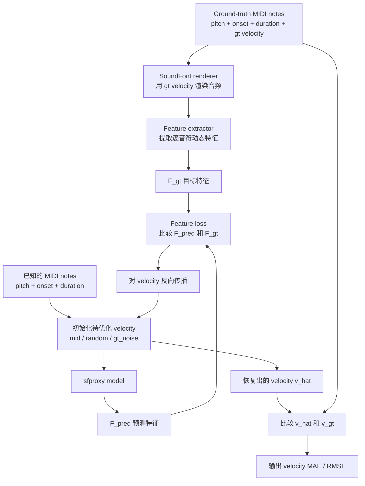

# SFProxy 项目与 Evaluation 说明

## 项目在做什么

这个仓库现在聚焦在一条很明确的工作流上：

1. 从 `.sf2` 或 `.sfz` 乐器导出 note-conditioned teacher data
2. 训练一个神经 proxy，学习 note-wise dynamics feature
3. 评估这个 proxy 是否具有合理的 velocity 响应，以及是否足够稳定到可以支持反演

它不是一个泛化的 audio generation 项目，也不是在做 end-to-end transcription。  
它更像是一个 **可微的 dynamics surrogate**：给定 note 条件和 velocity，预测逐音符动态特征。

---

## 一句话总结 Evaluation 在问什么

这个 evaluation 主要在回答一个很具体的问题：

**如果我们知道 MIDI notes，只把 note velocity 藏起来，sfproxy 能不能提供有用的梯度，让我们把 ground-truth velocity 从目标 note feature 里反推回来？**

更进一步地说，我们关心的不只是“拟合得像不像”，而是：

- 它对 velocity 的响应是不是方向正确
- 这种响应是不是连续、稳定、可优化
- 在正常分布和更难分布下，这种性质是否还能成立

所以这套 evaluation 的重点不是普通 supervised test loss，而是：

- **functional validity**
- **gradient usefulness**
- **recovery stability**

---

## Evaluation 的两层设计

当前 evaluation 分成两层：

1. `monotonic`
2. `velocity_recovery`

入口在 [eval.py](/media/mengh/SharedData/zhanh/202604_midiproxy/synth-proxy/src/eval.py)。

### 第一层：Monotonicity

`monotonic` 是最基础的 sanity check，相关实现：

- [eval_monotonic.py](/media/mengh/SharedData/zhanh/202604_midiproxy/synth-proxy/src/eval_monotonic.py)
- [monotonic_sweep.py](/media/mengh/SharedData/zhanh/202604_midiproxy/synth-proxy/src/tools/monotonic_sweep.py)

它做的事情很简单：

- 固定一个单音的 `pitch / onset / duration`
- 只扫描 velocity，从低到高取一串点
- 观察 proxy 输出的某个 feature 是否随 velocity 增大而大致上升
- 统计是否出现违反单调性的点

这一步想说明的是：

**至少在最简单、最可解释的局部条件下，proxy 对 velocity 的响应不要乱。**

对于 piano，像 harmonic energy 这种 feature，一般应该随 velocity 上升而增强。如果连这一点都不满足，后面的 velocity recovery 就没有基础。

但 monotonicity 的定位要摆正：

- 它是一个必要条件
- 它不是充分条件

因为它只测了：

- 单音
- 固定上下文
- 单个 feature 维度

它不能回答：

- 多音重叠时是否稳定
- feature 量值是否准确
- 梯度是否足够可用于实际反演

所以它更像是底线检查，不是最终证据。

---

## 第二层：Velocity Recovery

真正更有科研含量的是 `velocity_recovery`，实现主要在：

- [eval_velocity_recovery.py](/media/mengh/SharedData/zhanh/202604_midiproxy/synth-proxy/src/eval_velocity_recovery.py)
- [eval.yaml](/media/mengh/SharedData/zhanh/202604_midiproxy/synth-proxy/configs/eval.yaml)

这个测试的核心思想是：

- 用真实 renderer 和 ground-truth velocity 渲染音频
- 从真实音频里提取逐音符 dynamics feature，得到 `F_gt`
- 然后把 velocity 隐掉，只保留 notes
- 初始化一个猜测 velocity
- 用 sfproxy 预测 `F_pred`
- 最小化 `Loss(F_pred, F_gt)`，直接对 velocity 反向传播
- 最后比较恢复出来的 `v_hat` 和真实的 `v_gt`

可以用下面这张图理解：



---

## `target` 和 `pred` 到底是什么

### `target`

`target` 不是 velocity 本身。

`target` 是用 ground-truth velocity 渲染出来的真实音频，再经过手工定义的 dynamics feature extractor 提取得到的逐音符特征：

```text
audio_gt = RenderSF(notes, v_gt)
F_gt     = FeatureExtractor(audio_gt, notes)
```

这里的 feature extractor 不是 proxy 模型自己，而是  
[dynamics.py](/media/mengh/SharedData/zhanh/202604_midiproxy/synth-proxy/src/features/dynamics.py) 里的手工特征提取器。

当前主要包括：

- harmonic energy
- onset flux

### `pred`

`pred` 是 sfproxy 在当前猜测 velocity 下预测出来的 feature：

```text
F_pred = SFProxy(notes, v_candidate)
```

所以整个 optimization loop 实际上是：

```text
不断调整 v_candidate
让 F_pred 尽量接近 F_gt
```

一个常见误解是：

```text
F_gt = SFProxy(notes, v_gt)
```

这不是当前 evaluation 在做的事情。  
`F_gt` 来自 renderer 音频和 hand-crafted feature extractor，而不是 proxy 自己。

---

## 为什么最终指标是 Velocity MAE / RMSE

关键区别是：

- `feature loss` 是优化工具
- `velocity error` 是最终评估目标

也就是说：

- `Loss(F_pred, F_gt)` 用来引导优化
- `vel_mae / vel_rmse` 用来判断 recovery 是否真的成功

这是必要的，因为 feature matching 可能有歧义。

在复杂场景下，比如：

- 多音重叠很强
- chord 很大
- IOI 很短

不同 velocity 可能会得到相似 feature。于是会出现一种情况：

```text
feature error 很小
但 velocity 仍然不准
```

所以只看 feature loss 不够。  
最终还是要回到：

- `vel_mae`
- `vel_rmse`

当前实现里还会同时报告：

- `init_vel_mae`
- `mae_improvement_vs_init_pct`
- `feat_mae_at_vhat`
- `opt_loss_final`

它们分别回答：

- 优化前有多差
- proxy 的梯度有没有帮助
- 恢复后的 velocity 在 feature 空间里是否真的解释了 target
- 优化过程是否收敛

一句话说：

**feature loss 是工具，velocity error 才是答案。**

---

## `in-domain` 和 `stress` 是什么意思

这不是两份真实数据集，而是同一个 instrument / renderer 条件下的两种 synthetic evaluation setting。

### `in-domain`

含义是：

- sampler 分布更接近训练和导出时的默认设置
- polyphony、overlap、note density 比较正常

它更像“常规情况”。

### `stress`

含义是：

- 更高的 polyphony
- 更大的 chords
- 更短的 IOI
- 更强的 note overlap

它更像“压力测试”。

要特别注意的是：

`stress` 不是换乐器，也不是换录音域。  
它仍然是同一个 Salamander piano、同一个 SoundFont 条件，只是 note configuration 更难。

这两个设置分别在回答：

- `in-domain`：proxy 在正常使用条件下是否可靠
- `stress`：proxy 在更复杂 note interaction 下是否退化，以及退化到什么程度

---

## 这套 Evaluation 真正证明了什么

如果结果好，它主要说明：

- proxy 对 velocity 的变化有响应
- 这种响应方向上是合理的
- feature 对 velocity 的梯度是可用的
- 用梯度来做 velocity recovery 是可行的

如果 `stress` 明显比 `in-domain` 差，通常说明：

- 模型在正常 note 布局下已经可用
- 但一旦音符重叠变多、布局更密，它的可靠性会下降

所以这套 evaluation 证明的不是“模型什么都能泛化”，而是：

**在当前 instrument / renderer / feature family 下，这个 proxy 是否是一个稳定、可微、可反演的 dynamics surrogate。**

这是一种很重要的 mechanistic validity，而不是传统 supervised benchmark 那种外部泛化结论。

---

## 从科研角度看，这个设计为什么合理

我认为它整体是合理的，而且方向是对的。主要原因有三点：

1. 它评测的是“可用性”，不只是“拟合性”
2. 它把正常条件和压力条件区分开了，可以看鲁棒性
3. 它用 renderer + feature extractor 来定义 target，避免了 proxy 自己和自己对齐的自证循环

这点其实很关键。  
如果 evaluation 只是“拿 proxy 预测 proxy 定义的目标”，那很容易高估模型。现在这套设计至少让 target 来自外部生成过程，而不是 proxy 本身。

---

## 这套 Evaluation 目前还不能充分证明什么

它现在还不能充分回答这些问题：

- 跨乐器是否稳定
- 跨 renderer 是否稳定
- 对真实演奏数据是否稳定
- 对更高层音乐分布变化是否稳定
- 对不同随机种子训练结果是否稳定

所以如果用更严谨的科研语言来说，当前 evaluation 主要覆盖的是：

- local functional validity
- synthetic recovery robustness

而不是完整的：

- domain generalization
- real-data validity
- training stability

---

## 如果要讨论“sfproxy 是否稳定”，应该怎么拆

“稳定”这个词太大了，建议拆成三类来讨论。

### 1. Functional stability

看这些问题：

- proxy 对 velocity 的响应是否单调
- recovery 是否能稳定下降误差
- feature-space guidance 是否一致

对应当前已有评测：

- `monotonic`
- `velocity_recovery`

### 2. Distributional stability

看这些问题：

- 从 `in-domain` 到 `stress`，性能退化多少
- 不同 sampler mixture 下，recovery 是否稳定
- 更稠密、更复杂的 note layout 是否会导致明显崩坏

当前已有一部分：

- `in-domain`
- `stress`

但 sampler mixture 的系统对比还没有真正补齐。

### 3. Training stability

看这些问题：

- 不同 seed 是否稳定
- 不同数据量是否稳定
- 不同 checkpoint 阶段是否稳定

这一部分现在基本还没有系统化做完。

---

## 我目前最看重、也最缺的两类实验

这是我觉得最值得补的地方，也是最能直接服务你们当前科研判断的地方。

### 1. 不同 checkpoint / 不同数据量下的 recovery 曲线

这个实验想回答：

- 模型是不是越训越“可反演”
- 数据变多以后，recovery 是不是持续提升
- 提升是先快后慢，还是存在明显饱和点
- `stress` 条件下的稳定性是不是比 `in-domain` 更依赖数据量

为什么它重要：

因为你现在关心的一个核心问题就是：

**sampler 生成那么多数据到底有没有必要。**

如果只是看 train loss 或 val loss，很难回答这个问题。  
但如果看 recovery 指标随数据量变化的曲线，就能更直接判断：

- 更多数据是在提升 proxy 的“可用性”
- 还是只是让表面 loss 更漂亮

这类实验会直接帮助你判断 foundation setting 下，到底 sample 多少数据才是值得的。

### 2. 不同 sampler mixture 下的 recovery 变化

这个实验想回答：

- 哪些 sampler 真的提升了 proxy 的可识别性
- mixed 比例是否只是平均化训练，而不一定提升 recovery
- `coverage / realism / stress / boundary` 各自对 `in-domain` 和 `stress` 指标有什么不同影响

为什么它重要：

因为你们现在的数据设计核心不是只有“量”，还有“配方”。  
也就是说，真正的研究问题不是：

```text
数据越多越好吗
```

而更像是：

```text
什么样的数据组成
更能让 proxy 学到稳定、可反演的 velocity response
```

如果没有这组实验，你就很难说服别人：

- 为什么要用某个 mixture
- 为什么某个比例比另一个比例更合理
- `stress` sampler 是否真的值得加入

---

## 我会如何组织后续的实验叙事

如果后面要写成 paper-style evaluation section，我会建议按下面这条线组织：

1. 先做 basic functional validity  
   用 monotonicity 说明 proxy 至少满足基本方向性

2. 再做 core utility test  
   用 velocity recovery 说明它不只是“像”，而且“可用于反演”

3. 再做 robustness  
   比较 `in-domain` 和 `stress`

4. 最后做 stability ablation  
   比较不同数据量、不同 sampler mix、不同训练阶段

这样一来，每个实验回答的问题都很清楚：

- monotonic：局部响应合理吗
- recovery：梯度有用吗
- stress：复杂布局下会不会崩
- size/mix ablation：数据策略是否真的带来稳定收益

---

## 一个很重要的科研判断

我觉得你们现在这套 evaluation 最有价值的地方在于：

它没有把 sfproxy 当成一个普通回归模型，而是把它当成一个未来要被“使用”的 surrogate model。

所以评测重点自然应该是：

- 能不能被优化
- 能不能支持反演
- 在复杂情形下是否还能提供可靠梯度

这其实很符合 foundation 或 tool model 的思路。  
因为 foundation 不只是追求“平均误差低”，还要追求：

- 行为稳定
- 功能可靠
- 在不同设置下结论一致

从这个角度看，当前 evaluation 的方向是对的。  
下一步不应该推翻它，而应该围绕数据量、sampler 比例、seed、domain，把它扩展成一个更完整的 stability story。

---

## 实用命令

训练：

```bash
python src/train.py \
  dataset.train.path=/path/to/export_train_folder \
  dataset.val.path=/path/to/export_val_folder
```

单调性评测：

```bash
python src/eval.py \
  mode=monotonic \
  ckpt_path=/path/to/checkpoint.ckpt
```

velocity recovery 评测：

```bash
python src/eval.py \
  mode=velocity_recovery \
  ckpt_path=/path/to/checkpoint.ckpt
```

---

## 最后的简化版理解

你可以把当前 evaluation 简单理解成四句话：

1. 用真实 velocity 渲染出音频，并从音频里提取目标 feature
2. 用 sfproxy 在猜测 velocity 下预测 feature
3. 通过 feature loss 来优化 velocity
4. 最后检查恢复出来的 velocity 是否真的接近 ground-truth

所以：

- monotonicity 检查的是“方向感”
- recovery 检查的是“能不能拿来做事”
- `in-domain` 和 `stress` 检查的是“复杂情况下是否还稳”

而我目前最想补的，是：

- 不同 checkpoint / 不同数据量下的 recovery 曲线
- 不同 sampler mixture 下的 recovery 变化

因为这两类实验最能回答你现在真正关心的问题：

**sample 多少才够，sample 什么才对。**
